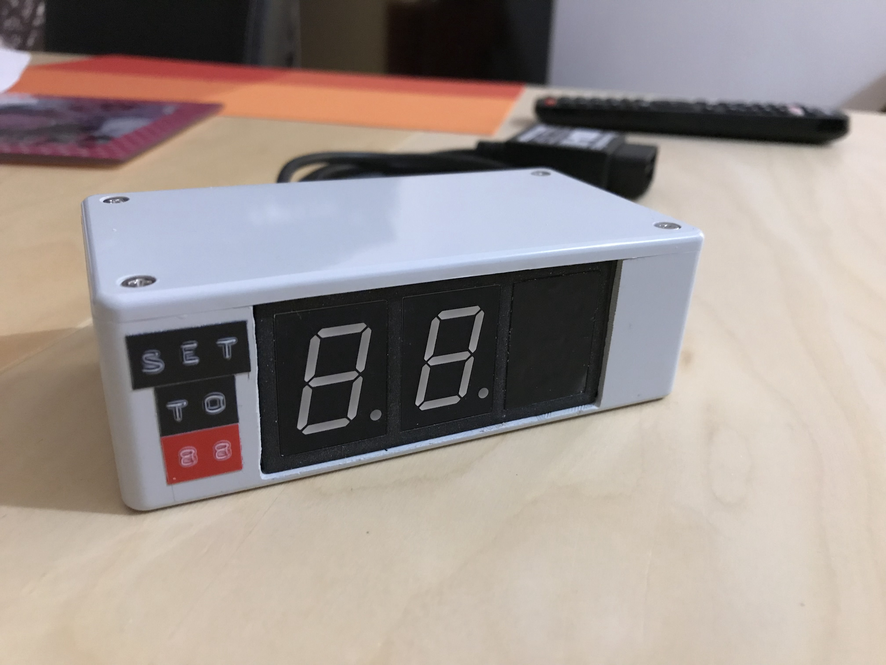

Arduino-based Back to the Future DeLorean Speedometer
=====================================================

Finished prototype
------------------

License
-------
    Copyright (C) 2017  Baptiste Candellier

    This program is free software: you can redistribute it and/or modify
    it under the terms of the GNU General Public License as published by
    the Free Software Foundation, either version 3 of the License, or
    (at your option) any later version.

    This program is distributed in the hope that it will be useful,
    but WITHOUT ANY WARRANTY; without even the implied warranty of
    MERCHANTABILITY or FITNESS FOR A PARTICULAR PURPOSE.  See the
    GNU General Public License for more details.

    You should have received a copy of the GNU General Public License
    along with this program.  If not, see <https://www.gnu.org/licenses/>.

Components
----------

| Part                          | Qty  | Manufacturer   | Reference          |
|-------------------------------|------|----------------|--------------------|
| OBD-II UART Adapter V2        | x1   | Freematics     | OBD-U              |
| Microcontroller               | x1   | Arduino        | Arduino Nano       |
| Enclosure                     | x1   | Hammond        | 1591C              |
| 7-segment display             | x3   | Multicomp      | LS0803SRWK         |
| Potentiometer                 | x1   | Vishay         | 3296W-1-203LF      |
| Slide switch                  | x1   | C&K            | OS102011MA1QN1     |
| Slide switch                  | x1   | Knitter-Switch | MFS131D            |
| Resistor (165 Ω)              | x8   | Vishay         | MRS25000C1650FCT00 |
| DB25 male connector           | x1   | FCI            | DB25S064TLF        |
| DB25 female connector + shell | x1   | MH             | MHDTPPK-25         | 
| 10-pin wire-to-board housing  | x1   | Molex          | 22-01-2105         |
| 5-pin wire-to-board housing   | x1   | Molex          | 22-01-2055         |
| 10-pin wire-to-board header   | x1   | Molex          | 22-27-2101         |
| 5-pin wire-to-board header    | x1   | Molex          | 22-27-2051         |
| Crimp terminal                | many | Molex          | 0008500113         |
| Labels                        | x3   | Dymo           | Omega              |
